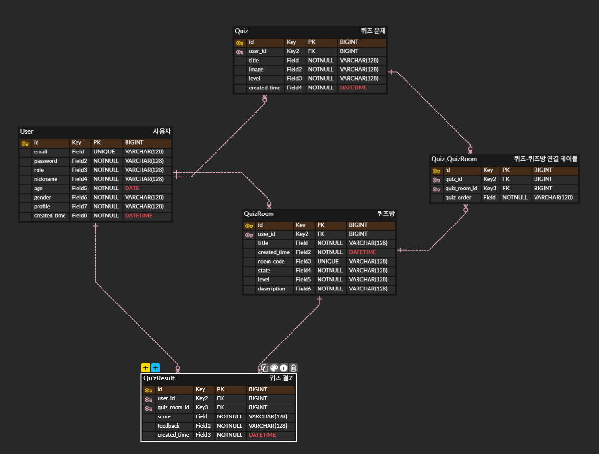
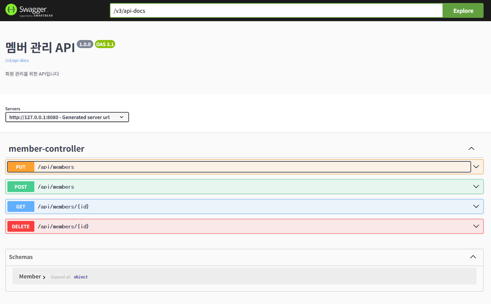

# WritePrompt_Planning_구미3반_송희준_황문규

# 요구사항

## 기능적 요구사항

|번호|분류|요구사항명|요구사항 상세|우선순위|
|:-:|:-:|:-:|:-:|:-:|
|C01|공통|유저 회원가입| 회원가입 기능 구현|필수|
|C02|공통|유저 로그인| 로그인 기능 구현|필수|
|C03|공통|유저 로그아웃| 로그아웃 기능 구현|필수|
|C04|공통|프롬프트를 활용한 이미지 생성|유저가 만든 프롬프트를 기반으로 AI가 이미지 생성|필수|
|C05|공통|퀴즈 목록 (게시판)|생성된 퀴즈를 확인할 수 있는 게시판|필수|
|C06|공통|답안 채점|제출된 프롬프트로 생성된 그림과 정답 그림 간의 유사도를 기반으로 정확도 측정|필수|
|T01|교사|프롬프트 생성|키워드 기반 / 사용자 입력 기반으로 AI가 프롬프트 생성|필수|
|T02|교사|퀴즈 관리|프롬프트 기반으로 이미지를 만들어진 퀴즈 관리  (등록, 수정, 삭제, 조회)|필수|
|T03|교사|퀴즈룸 관리|만들어진 퀴즈를 선택하여 퀴즈 풀이방 관리  (등록, 수정, 삭제, 조회)|필수|
|S01|학생|퀴즈 풀이|교사가 만든 퀴즈룸에 입장해 사진을 보고 그에 적합한 프롬프트를 정답으로 제출| 필수|
|S02|학생|퀴즈 점수 확인| 끝나면 해당 퀴즈의 총점 및 피드백 확인| 필수|
|S03|학생|학습 기록 확인| My Page에서 여태 진행한 퀴즈 학습 기록 (총점, 피드백 등) 확인 가능|선택|

---

## 비기능적 요구사항
| 번호 | 분류 | 요구사항명 | 요구사항 상세 |
|:-:|:-:|:-:|:-:|
| NF1 | 정확성 | AI의 정확성 | AI API를 활용함으로 인한 AI의 정확성이 요구됨 |
| NF2 | 가용성 | 가용성 | 언제나 어떤 디바이스로든 서비스 가능해야 함 |
| NF3 | 효율성 | 응답성 | 조회에 대한 결과를 빠르게 응답해야 함 |
| NF4 | UX | 사용자 편의성 | 웹 사이트에 대한 사전 지식이 없어도 쓰기 편해야 함 |

---

# ERD

---

# Member API

---

# Wireframe
